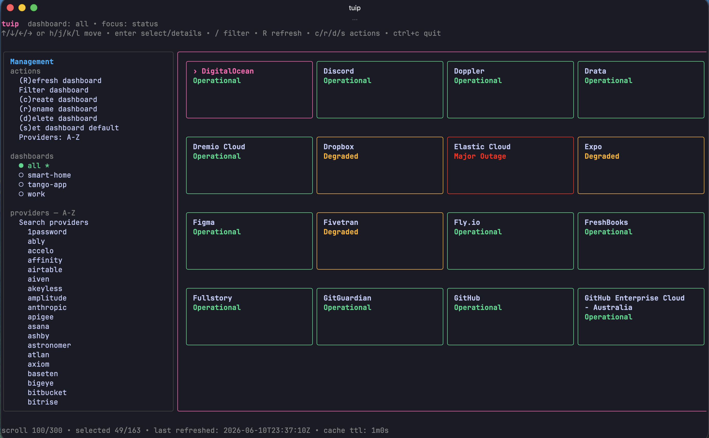
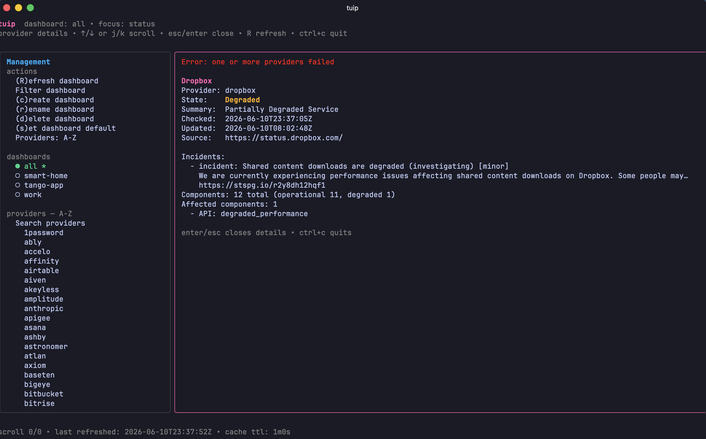

# tuip

[](https://github.com/ikan31/tuip/actions/workflows/ci.yml)

`tuip` is a terminal CLI and TUI for checking public SaaS status pages. It normalizes vendor-specific status APIs into one model so you can quickly inspect provider health from your shell or an interactive dashboard.

## Screenshots

<p align="center">
  
</p>

<p align="center"><em>Dashboard overview</em></p>

<p align="center">
  
</p>

<p align="center"><em>Provider details</em></p>

## Features

- **CLI and TUI workflows** for ad-hoc checks, reusable dashboards, and interactive status browsing.
- **Normalized status states**: `operational`, `degraded`, `partial_outage`, `major_outage`, `maintenance`, `unknown`, and `error`.
- **Built-in provider catalog** with SaaS, cloud, data, developer tools, observability, collaboration, finance, HR, and related services.
- **Shareable YAML dashboards** backed by stable provider IDs.
- **Detailed provider output** when available, including incidents, maintenance windows, components, source URLs, and update timestamps.
- **No credentials required** for built-in providers; `tuip` only uses public status APIs/pages.

## Installation

### Homebrew

```bash
brew install ikan31/tap/tuip
```

### Go

```bash
go install github.com/ikan31/tuip/cmd/tuip@latest
```

Make sure your Go install directory is on your `PATH`:

```bash
export PATH="$(go env GOPATH)/bin:$PATH"
```

### GitHub Releases

Tagged releases publish prebuilt binaries and checksums to [GitHub Releases](https://github.com/ikan31/tuip/releases).

### From source

```bash
go run ./cmd/tuip --help
```

Build a local binary:

```bash
go build -o tuip ./cmd/tuip
./tuip --help
```

## Quick start

Check a few providers:

```bash
tuip status slack github cloudflare
```

Open the interactive TUI:

```bash
tuip
```

Find providers:

```bash
tuip providers list
tuip providers search github
```

Create and use a dashboard:

```bash
tuip dashboard create work slack github jira asana cloudflare
tuip dashboard use work
tuip status
```

## CLI reference

Global flags:

- `--config <path>` overrides the config file path.
- `--log-level <off|debug|info|warn|error>` enables diagnostics logging. It defaults to `TUIP_LOG_LEVEL`, then `off`.

### `tuip status`

Fetch provider statuses.

```bash
tuip status [provider...]
```

With no provider IDs, `tuip status` checks the configured default dashboard.

Examples:

```bash
tuip status slack github cloudflare
tuip status --details cloudflare
tuip status --json github jira asana
tuip status --dashboard work
```

Flags:

- `--json` writes normalized JSON for scripts.
- `--details` includes incidents, scheduled maintenance, and components when the provider exposes them.
- `--dashboard <name>` checks a named configured dashboard.

### `tuip providers`

Discover built-in provider IDs.

```bash
tuip providers list
tuip providers search github eu
tuip providers search qbo
```

Aliases are accepted anywhere provider IDs are used.

### `tuip dashboard`

Manage YAML dashboards.

```bash
tuip dashboard create work slack github cloudflare
tuip dashboard add work jira asana
tuip dashboard remove work github
tuip dashboard use work
tuip dashboard list
tuip dashboard show work
```

`dashboard` also has the alias `dashboards`.

## Interactive TUI

Run the TUI with no subcommand:

```bash
tuip
```

The TUI loads the configured default dashboard. If no default dashboard exists, it shows the virtual `all` dashboard with every built-in provider.

Common keys:

- Arrow keys or `h`/`j`/`k`/`l`: move through panes and status cards.
- `enter`: select management items, select dashboards, toggle providers, or open status details.
- `/`: focus the dashboard filter in the status pane.
- `esc`: leave filter/details focus without quitting.
- `c`, `r`, `d`, `s`: create, rename, delete/details, or set the default dashboard.
- `R`: force-refresh the active dashboard and bypass the cache.
- `ctrl+c`: quit.

The TUI keeps a 60-second provider-level status cache. Error snapshots are cached for 10 seconds.

## Built-in providers

`tuip` ships with more than 180 built-in providers. Use the CLI as the source of truth for the current catalog:

```bash
tuip providers list
tuip providers search github
tuip providers search qbo
```

Provider IDs are stable and intended for dashboard config. Aliases are accepted in CLI commands and dashboard config; for example, `qbo` resolves to `quickbooks-online`, and `ghec-eu` resolves to `github-enterprise-cloud-eu`.

Provider source notes:

- Most providers use Atlassian Statuspage-compatible JSON (`/api/v2/summary.json`).
- Some providers use PagerDuty-hosted status-page JSON (`/api/data`).
- Some providers use Uptime Kuma public status-page JSON.
- Slack uses Slack's public status API for top-level status and active incidents.

## Configuration

Dashboard config is YAML. Dashboard name `all` is reserved for `tuip`'s virtual dashboard containing every built-in provider.

Default location on macOS/Linux:

```text
~/.config/tuip/config.yaml
```

If `XDG_CONFIG_HOME` is set, `tuip` uses:

```text
$XDG_CONFIG_HOME/tuip/config.yaml
```

Windows uses the native OS user config directory.

Override the config path:

```bash
tuip --config ./tuip.yaml dashboard list
```

Example config:

```yaml
version: 1
default_dashboard: work

dashboards:
  work:
    services:
      - provider: slack
      - provider: github
      - provider: jira
      - provider: asana
      - provider: cloudflare
```

Runtime files live beside the configured config file:

```text
~/.config/tuip/
  config.yaml
  logs/tuip.jsonl
  cache/status-cache.json
```

Diagnostics are off by default. Enable them with either:

```bash
TUIP_LOG_LEVEL=debug tuip
# or
tuip --log-level debug
```

`tuip.jsonl` is rotated when it reaches 5MB. `tuip` keeps up to three older files as `tuip.1.jsonl`, `tuip.2.jsonl`, and `tuip.3.jsonl`. Each log line includes a `run_id`, `pid`, and `version`.

## Privacy and network access

- Built-in providers do not require credentials.
- `tuip` fetches public status APIs/pages only for the providers you check.
- Dashboard config, status cache, and diagnostics logs are written locally under the configured config directory.
- Diagnostics logs are disabled by default. When enabled, they include provider IDs, timing, cache, retry, and error information for troubleshooting.

## Development

Common commands:

```bash
make fmt
make lint
go test ./...
```

Build locally:

```bash
make build
./bin/tuip --help
```

Release builds are produced by GoReleaser when a `v*` tag is pushed:

```bash
git tag -a v1.0.0 -m "tuip v1.0.0"
git push origin v1.0.0
```

Provider contribution guidance lives in [`CONTRIBUTING.md`](./CONTRIBUTING.md). Architecture and implementation notes live in [`docs/architecture.md`](./docs/architecture.md).
